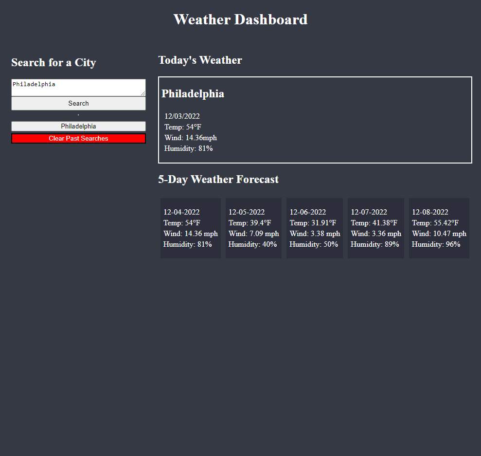

# Weather Dashboard

This application allows a user to search for a city and see a basic weather forecast for the current day as well as the following five. 

The application stores the user's inputs locally, allowing them to leave or refresh the page without losing any previously searched cities, though functionality also exists to allow the user to clear out prior searches to maintain a clean interface.

## Technologies Used

HTML, CSS, JavaScript, Moment.js, API Querying ([OpenWeather's](https://openweathermap.org/) 5-day Forecast and Geocoding APIs).

## Application
The homepage can be viewed [here](https://chocochip287.github.io/weather-dashboard/).

## Screenshot
